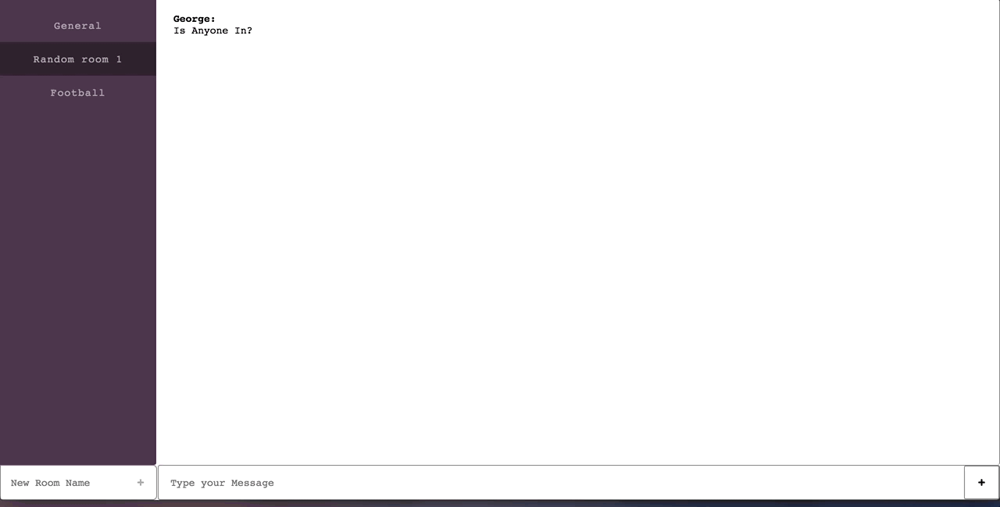

# React simple slack clone

A simple slack clone using reactjs, nodejs, socketio. 
Check online(wait a little for link to load): https://react-slack-clone.herokuapp.com/

## Getting Started

For running the project locally steps are:
1) Clone the project
2) open a terminal and type yarn start-server or npm run start-server 
3) open another terminal and type yarn start-client on npm run start-client

## Built With

* reactjs
* socket.io
* expressjs
* emotionjs for css in javascript
* create react app as base for client.
